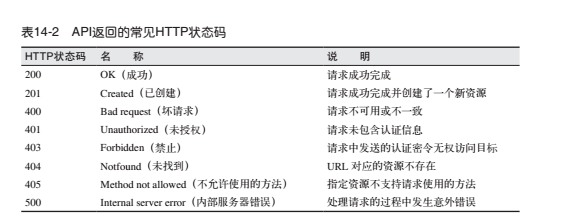
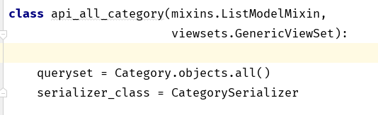
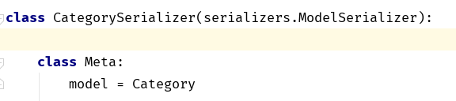
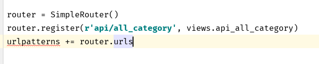

REST简介

---

### REST

简介

*   客户端与服务器之间必须有明确的界限
*   无状态
    *   客户端发出的请求中必须包含所有必要的信息, 服务器不能再两次请求之间保存客户端的任何状态
*   缓存
    *   服务器发出的响应可以标记为可缓存或不可缓存, 这样出于优化的目的, 客户端(或客户端和服务器之间的中间服务)可以使用缓存
*   接口统一
    *   客户端访问服务器资源时使用的协议必须一致, 定义良好, 而且已经标准化. REST Web 服务器最常使用的接口是 HTTP 协议
*   系统分层
    *   客户端和服务器之间可以按需插入代理服务器, 缓存或网关, 以提高性能, 稳定性和伸缩性
*   按需代码
    *   客户端可以选择从服务器上下载代码, 在客户端环境中执行

资源 

*   一个 url 对应的一个或者是一组资源的访问地址

请求和响应

*   在请求和响应的主题中, 资源在客户端和服务器之间来回传送, 但REST没有么有指定编码资源的方式, 请求和响应中的 Content-type 首部用于指定主题中资源的编码方式, 使用 HTTP 协议中的协商机制, 可以找到一种客户端和服务器都支持的编码方式
*   JSON 的引用, 是编码方式变得统一, 也使资源的可读性相较于 XML 提高

Django中的最简单的 API 

-   注册 rest_framework 到  INSTALLED_APP 中
-   在 url 中注册需要 的 API 接口
-   在 views 中 写入对应的  class 视图
-   编写对应的简单序列化器, 最简单的就是直接写入对应的模型

==views.py==

序列化器

url.py

