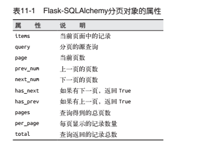
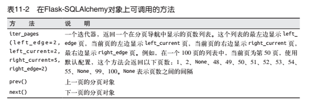
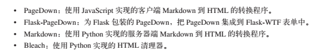

>作者: 张明禄
>
>说明: 本文主要是学习\<Flask Web开发：基于Python的Web应用开发实战>一书而写的笔记, 内容有很多的截图都是来自此书, 想要学习更多请下载官方正版进行阅读


Flask-用户角色

---

第九章

角色和权限

```python
class Role(db.Model):
    __tablename__ = 'tb_roles'
    id = db.Column(db.Integer, primary_key=True, autoincrement=True)
    name = db.Column(db.String(64), unique=True)
    default = db.Column(db.Boolean, default=False, index=True)
    permissions = db.Column(db.Integer)
    users = db.relationship('User', backref='role', lazy='dynamic')
```








#### 支持 markdown格式文本和 Flask-pageDown




