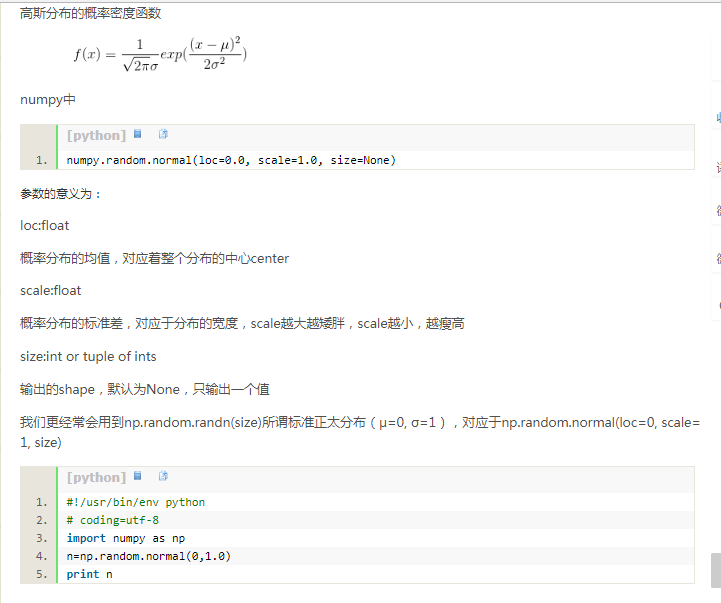

matplotlib 笔记


#### matplotlib


```python
import matplotlib.pyplot as plt
import numpy as np

%matplotlib inline

x = np.linspace(1, 3, 50) # 在[1, 3] 中等距离取50个数
y = x ** 2 + 1
plt.plot(x, y)
# x y 轴刻度文字的大小
plt.tick_params(axis='both', labelsize=14)
plt.xlabel('x', fontsize='20')
plt.ylabel('y', fontsize='20')
# x y 轴的坐标范围
plt.axis([0, 4, 0, 11])
plt.show()

```


#### seed()

-   用于指定随机数生成时所用的算法开始的整数值, 如果使用相同的seed() 值,那么每次生成的随机数都是相同的, 如果不设置这个值, 那么系统就会根据时间来自己选择这个值, 此时生成的随机数因为时间的不同而不同
-   可以使下一次产生的随机数与 所有的 seed(n) 中的随机数是一样的


####正态分布  np.random.normal()



####绘制散点图

```python
import numpy as np
import matplotlib as mpl
import matplotlib.pyplot as plt
 
# 通过rcParams设置全局横纵轴字体大小
mpl.rcParams['xtick.labelsize'] = 24
mpl.rcParams['ytick.labelsize'] = 24
 
np.random.seed(42)
 
# x轴的采样点
x = np.linspace(0, 5, 100)
 
# 通过下面曲线加上噪声生成数据，所以拟合模型就用y了……
y = 2*np.sin(x) + 0.3*x**2
y_data = y + np.random.normal(scale=0.3, size=100)
 
# figure()指定图表名称
plt.figure('data')
 
# '.'标明画散点图，每个散点的形状是个圆
plt.plot(x, y_data, '.')
 
# 画模型的图，plot函数默认画连线图
plt.figure('model')
plt.plot(x, y)
 
# 两个图画一起
plt.figure('data & model')
 
# 通过'k'指定线的颜色，lw指定线的宽度
# 第三个参数除了颜色也可以指定线形，比如'r--'表示红色虚线
# 更多属性可以参考官网：http://matplotlib.org/api/pyplot_api.html
plt.plot(x, y, 'k', lw=3)
 
# scatter可以更容易地生成散点图
plt.scatter(x, y_data)
 
# 将当前figure的图保存到文件result.png
plt.savefig('result.png')
 
# 一定要加上这句才能让画好的图显示在屏幕上
plt.show()
```

