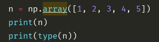
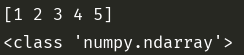
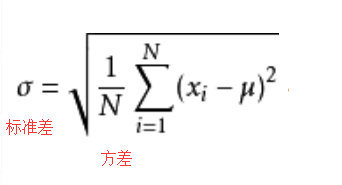
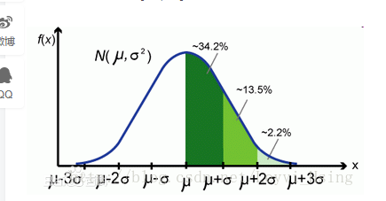
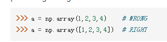
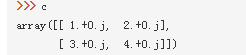
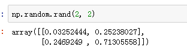
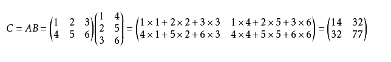
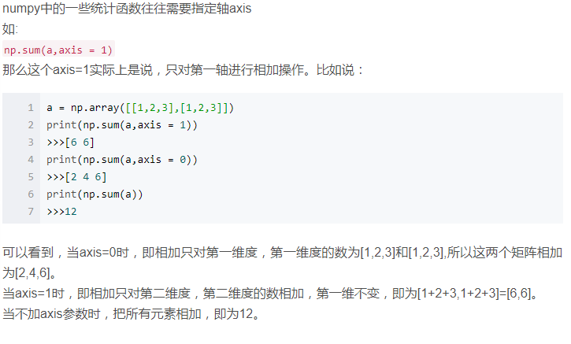
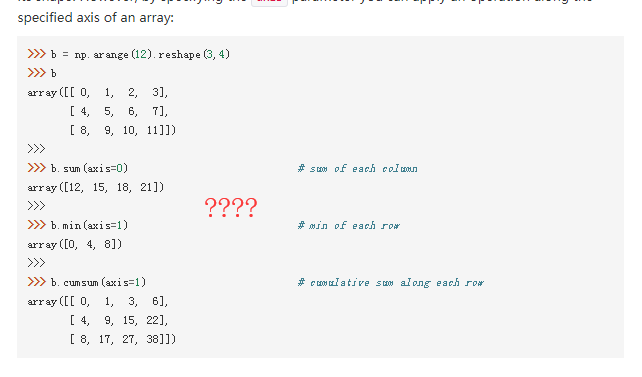

Numpy

---

[TOC]


#### 基本命令

-   读取文件
-   numpy.genfromtext() 读取txt 文件, 传入的参数为
    1.  需要读取的 txt 文件位置, 相对或者绝对路径
    2.  分割的标记
    3.  转换的类型, 如果文件中既有文本类型也有数字类型, 就先转成文本
-   help(np.genfromtext) 查看帮助文档




#### 正态分布

-   也叫   常态分布  高斯分布

-   数学期望  一组数据的均值  

    ​

    ​

    ​

    ​

-   方差   即 标准差的平方







```python
[[1., 2., 3.], [4., 5., 6.]] 这个数组有两个轴, 第一个轴为[[],[]], 长度为2
 第二个轴为[1., 2., 3.] 或者 [4., 5., 6.]  长度为3
 
ndarray.ndim 阵列的维度

ndarray.shape 数组的大小尺寸
    n 行 m 列 的数组其 shape 是(n,m)
```


-   ndarray.shape
    -   数组元素的维度
-   ndarray.dtype
    -   数组中元素类型    int32  int16 float64
-   ndarray.itemsize
    -   每个元素的字节的大小 float64   itemsize 是 8(=64/8)
    -   complex32   itemsize 是 4(=32/8)   相当于  ndarray.dtype.itemsize
-   ndarray.data
    -   该缓冲区包含的数组的实际元素, 通常


#### np.array()

-   应该使用数字序列(列表, 元组等)来作为参数, 而不是单一的数字




-   可以在创建 array 时指定其 dtype

    -   `c = np.array([1,2], [3, 4], dtype=complex)` 指定为复数

    

-   通常情况下数组的元素是未知的, 但它的大小是已知的, 因此, Numpy提供了几个函数来创建初始占位符数组, 最大限度减少了增加整列的必要性

-   zeros  创建一个充满 0 的数组

-   ones 创建一个充满 1 的数组

-   empty 创建一个 初始内容时随机的数组, 取决于内存的状态,

-   默认情况下创建的数组的 dtype 是 float64


-   `np.arange(1, 5, 2)`  间隔 2  取数字


-   当使用  arange  与浮点数参数一起使用时, 由于浮点数的有限的精度, 通常是不可以预测获得的元素的数量, 出于这个原因, 通常使用 linspace 来接收参数来获取我们想要的元素


```python
array([123,])  转化为 ndarray
zeros([1, 2])   生成 1 行 2 列的 ndarray
ones([2, 3])  生成 2 行 3 列 的 全是1 的 ndarray
zeros_like([2, 3])  将数组内的数全部转化为 0
empty()  生成随机的数组, 根据系统 的内存而定
arange(10)  生成[1, 10]的数组 可以指定 维度  reshape(2, 3) 2行3列
linspace(start, stop, space_num)  生成样本空间  start - stop 等距离取 num 个数
np.random.rand(2, 3)  传入的是参数, 不需要序列, 随机 0-1的数
np.random.randn(2, 3)  随机生成 -1-1的数填充数组
```




-   打印数组时, 如果数组的内容 过于 庞大而不方便完全显示, Numpy会自动跳过显示中间的元素, 将两头的元素显示出来


数组的运算就是对数组的每个元素进行的运算


矩阵的乘法




ndarray.dtype 得到的是 ndrray的数据类型,   结果为 例如 dtype('float64')

ndarray.dtype.name  得到的是 float64


axis 以轴为单位进行运算  axis

ndarray.sum(axis=0)  将数组按照每 列求和, 得到一个新的数组

  axis = 1  将数组按照每行求和  得到每行和的数组


三维数组就是 两个二维数组放在一个数组中 

-   空间三维坐标, ndarray(2, 3, 4) 表示 x 轴 2 个单位  y 轴3 个单位 z轴4个单位
-   更具最大数可以知道最多有多少个平面, 

四维数组就是两个三维数组放在一个数组中








